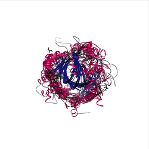
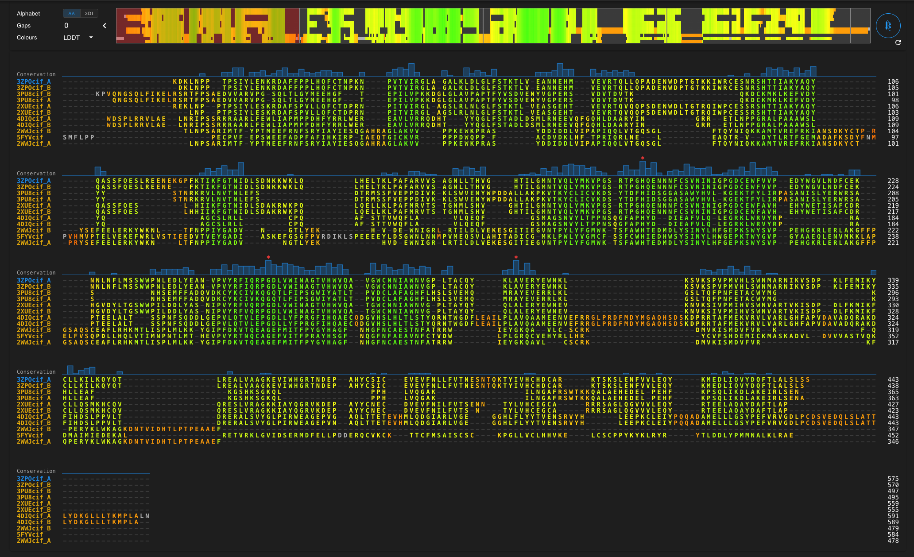

# REPORTE DE PRÁCTICA 2

## Alineamiento estructural en la superfamilia Cupin (CATH 2.60.120.650)

---
## Cupin
2.60.120.650

La superfamilia **cupin** es un grupo estructural caracterizado por un dominio tipo β-barrel conservado; el término “cupin” deriva del latín _cupa_ (barril), haciendo referencia a esta estructura secundaria que la caracteriza. 

Los miembros de esta superfamilia incluyen enzimas con funciones catalíticas diversas, así como proteínas de almacenamiento de semillas como vicilinas y leguminas.  
 
Dado que la estructura tridimensional suele conservarse más que la secuencia primaria, el análisis comparativo estructural permite detectar relaciones evolutivas profundas que no siempre son evidentes mediante alineamientos de secuencia.

El objetivo general de esta actividad fue:

- Realizar alineamientos estructurales múltiples con FoldMason.
- Analizar similitud estructural mediante FoldSeek.
- Calcular porcentaje de identidad y RMSD entre pares seleccionados.
- Interpretar la relación entre secuencia y estructura.



---

###  Selección de dominios en CATH

Se seleccionaron siete dominios pertenecientes a la superfamilia Cupin:

- 2WWJ_A01
- 2XUE_A01
- 4DIQ_B01
- 5FYV_A01
- 3ZPO_B01
- 3PU8_B01

Todos corresponden a dominios clasificados dentro de CATH 2.60.120.650.

La selección incluyó dominios con alta similitud esperada (controles) y otros potencialmente más divergentes, con el fin de evaluar distintos niveles de conservación estructural.

---

### Alineamiento estructural múltiple con FoldMason

Las estructuras fueron alineadas mediante FoldMason utilizando los códigos PDB correspondientes.

Se descargaron los siguientes archivos:

- [foldmason.pdb](../data/foldmason.pdb) (archivo multi-modelo con estructuras superpuestas)
- [foldmason_aa.fa](../data/foldmason.pdb)(alineamiento múltiple de secuencia)
- imágenes de superposición y MSA, que pueden ser encontradas en la carpeta [Carpeta figures](../results/)

El archivo `.pdb` contiene múltiples modelos delimitados por bloques:

```
MODEL
REMARK Name: 3ZPOcif_A
...
ENDMDL
```

Esto permitió trabajar con todas las estructuras dentro de un solo archivo superpuesto.

El alineamiento múltiple mostró conservación clara del núcleo β-barrel característico de la familia Cupin, incluso en dominios con divergencia secuencial.




---- 

### Resultados de FoldSeek

Se envió cada dominio individualmente contra la base PDB100, los resultados fueron integrados en la siguiente tabla:

| Dominio (CATH) | PDB cadena | Mejor hit (PDB)                                                            | Prob. | Seq. Id. (%) | TM-score |
| -------------- | ---------- | -------------------------------------------------------------------------- | ----- | ------------ | -------- |
| 3zpoB01        | 3ZPO_B     | [3zpo-assembly2_B](https://www.rcsb.org/structure/3zpo "3zpo-assembly2_B") | 1.00  | 100          | 1.000    |
| 3zpoB01        | 3ZPO_B     | [4uf0-assembly2_B](https://www.rcsb.org/structure/4uf0 "4uf0-assembly2_B") | 1.00  | 99.7         | 0.997    |
| 3pu8B01        | 3PU8_B     | [3pu3-assembly1_A](https://www.rcsb.org/structure/3pu3 "3pu3-assembly1_A") | 1.00  | 99.1         | 0.99     |
| 3pu8B01        | 3PU8_B     | [3pu8-assembly2_A](https://www.rcsb.org/structure/3pu8 "3pu8-assembly2_A") | 1.00  | 100          | 0.98     |
| 2xueA01        | 2XUE_A     | [2xue-assembly1_A](https://www.rcsb.org/structure/2xue "2xue-assembly1_A") | 1.00  | 100          | 1.000    |
| 2xueA01        | 2XUE_A     | [4ask-assembly1_A](https://www.rcsb.org/structure/4ask "4ask-assembly1_A") | 1.00  | 99.5         | 1.000    |
| 4diqB01        | 4DIQ_B     | [4diq-assembly1_B](https://www.rcsb.org/structure/4diq "4diq-assembly1_B") | 1.00  | 100          | 1.000    |
| 4diqB01        | 4DIQ_B     | [4cck-assembly1_B](https://www.rcsb.org/structure/4cck "4cck-assembly1_B") | 1.00  | 99.7         | 0.994    |
| 2wwjA01        | 2WWJ_A     | [6hgt-assembly4_D](https://www.rcsb.org/structure/6hgt "6hgt-assembly4_D") | 1.00  | 99.7         | 0.989    |
| 2wwjA01        | 2WWJ_A     | [5a7w-assembly2_B](https://www.rcsb.org/structure/5a7w "5a7w-assembly2_B") | 1.00  | 99.7         | 0.988    |
| 5fyvA01        | 5FYV       | [5fyv-assembly1_A](https://www.rcsb.org/structure/5fyv "5fyv-assembly1_A") | 1.00  | 100          | 1.000    |
| 5fyvA01        | 5FYV       | [5fzc-assembly1_A](https://www.rcsb.org/structure/5fzc "5fzc-assembly1_A") | 1.00  | 99.7         | 0.997    |
Tabla 1. Resultados FoldSeek (PDB100) tomando los primeros dos hits por dominio 

Como se observa claramente, ños primeros hits mostraron TM-scores cercanos a 1.0, identidades de secuencia >99 y una probabilidad estructural = 1.00

Esto confirma que varios dominios corresponden a variantes prácticamente idénticas o a determinaciones cristalográficas alternativas de proteínas muy conservadas.

La presencia de TM-scores cercanos a 1 indica superposición casi perfecta del plegamiento tridimensional.


---

### Modificación del script para cálculo de RMSD

 El script original [prog3.1.py](../scripts/prog3.1.py) permitía comparar únicamente dos estructuras individuales, por lo que se tuvieron que hacer algunas modificaciones, el script con los cambios aplicados se encuentra en [prog3.1_modified.py](../cripts/prog3.1_modified.py)

Se implementaron las siguientes modificaciones:

**Soporte para PDB multi-modelo**

Se añadió:

```python 
def foldmason_multimodel_coords(filename)
```

Esta función:

- Detecta bloques `MODEL/ENDMDL`
- Extrae el identificador desde `REMARK Name`
- Agrupa coordenadas Cα por residuo
- Devuelve un diccionario con las coordenadas por modelo

De esta manera se pueden manejar multiples estructuras en un solo archivo y de manera más significativa, calcular comparaciones arbitrarias entre pares, generalizando el script a alineamientos multiples.

**Procesamiento del alineamiento múltiple**

Se añadió la siguiente función:

```python 
def aligned_fasta(filename)
```

La cual permite:

- Leer MSA
- Mapear posiciones alineadas
- Extraer pares comparables

**Porcentaje de identidad**

Para cumplir con el requisito especifico de la asignación, se agrego una función que calcula el porcentaje de identidad 

```python
def percent_identity(alignmentA, alignmentB)
```

La cual devuelve el porcentaje, número de matches y número de posiciones comparadas 

Por último,  el script se modifico para permitir que los resultados se generaran en un archivo `.tsv` independiente, para facilitar la organización y el documentar los resultados de manera sistemática 

---
### RESULTADOS E INTERPRETACIÓN 

Con el objetivo de evaluar cuantitativamente la relación entre identidad de secuencia y conservación estructural dentro de la superfamilia Cupin, se seleccionaron distintos pares de dominios representando dos escenarios: (i) un control estructural y (ii) comparaciones entre un dominio y su hit estructural más cercano según FoldSeek. 

**Control**

1. `3ZPO_B` vs `3zpo-assembly2_B`

 **Entre dominios** 

6. `3ZPO_B` vs `2XUE_A`
7. `3PU8_B` vs `4DIQ_B`
8. `2WWJ_A` vs `5FYV_A`

Los resultados completos pueden consultarse en [Resultados completos en TSV](../results/results_domains.tsv)

| idA       | idB       | matches | pid | nCA | RMSD   |
| --------- | --------- | ------- | --- | --- | ------ |
| 3ZPOcif_B | 3ZPOcif_B | 100.00  | 438 | 438 | 0.375  |
| 3ZPOcif_B | 2XUEcif_A | 72.73   | 418 | 418 | 1.129  |
| 3PU8cif_A | 4DIQcif_B | 12.38   | 315 | 315 | 18.126 |
| 2WWJcif_A | 5FYVcif   | 32.91   | 313 | 313 | 3.226  |
**Tabla 2.** Resultados obtenidos del cálculo de porcentaje de identidad y RMSD.

El caso control, como era de esperarse, se obtuvo 100% de identidad de secuencia en 438 posiciones alineadas y un RMSD de 0.375 Å.

Este valor extremadamente bajo confirma que el procedimiento de extracción de coordenadas, alineamiento y cálculo mediante SVD funciona correctamente.

En un segundo nivel de comparación se evaluó `3ZPOcif_B` frente a `2XUEcif_A`, donde se observó una identidad de secuencia del 72.73% en 418 posiciones comparadas y un RMSD de 1.129 Å. Este resultado refleja una alta conservación estructural asociada a una identidad considerablemente elevada. Valores de RMSD cercanos a 1 Å son característicos de proteínas con plegamientos casi idénticos, lo que sugiere que estas estructuras comparten un núcleo tridimensional altamente conservado. 

El análisis se vuelve más informativo al considerar comparaciones con menor identidad, en el caso de `2WWJcif_A` frente a `5FYVcif`, la identidad fue de 32.91% en 313 residuos alineados, mientras que el RMSD fue de 3.226 Å. 

 Un RMSD alrededor de 3 Å sugiere que el núcleo estructural permanece conservado, pero existen variaciones significativas en regiones periféricas o en la orientación relativa de subdominios. Este resultado ejemplifica el principio fundamental de la biología estructural comparativa, que dice que la estructura tridimensional puede conservarse incluso cuando la secuencia ha divergido considerablemente.

Finalmente, el caso más extremo corresponde a la comparación entre `3PU8cif_A` y `4DIQcif_B`, con una identidad de 12.38% en 315 posiciones alineadas y un RMSD de 18.126 Å. Este valor indica una pérdida casi total de superposición estructural significativa. Un RMSD superior a 10 Å sugiere que, aunque ambos dominios estén clasificados dentro de la misma superfamilia, las diferencias estructurales acumuladas son excesivas. 


### CONCLUSIONES.

En conjunto, los resultados muestran una tendencia general: a mayor identidad de secuencia, menor RMSD; sin embargo, la relación no es lineal, ya que se observa que la estructura puede mantenerse razonablemente conservada incluso en rangos de identidad intermedia (~30%), mientras que identidades extremadamente bajas pueden estar asociadas con divergencias estructurales profundas. 

Esto permite reforzar la idea de que el núcleo β-barrel característico de la superfamilia Cupin es estructuralmente robusto, pero susceptible a variaciones significativas en presencia de divergencia evolutiva
