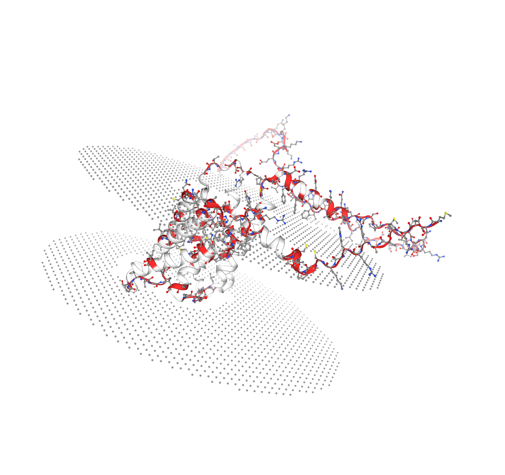
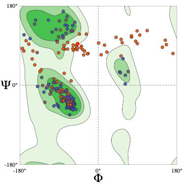
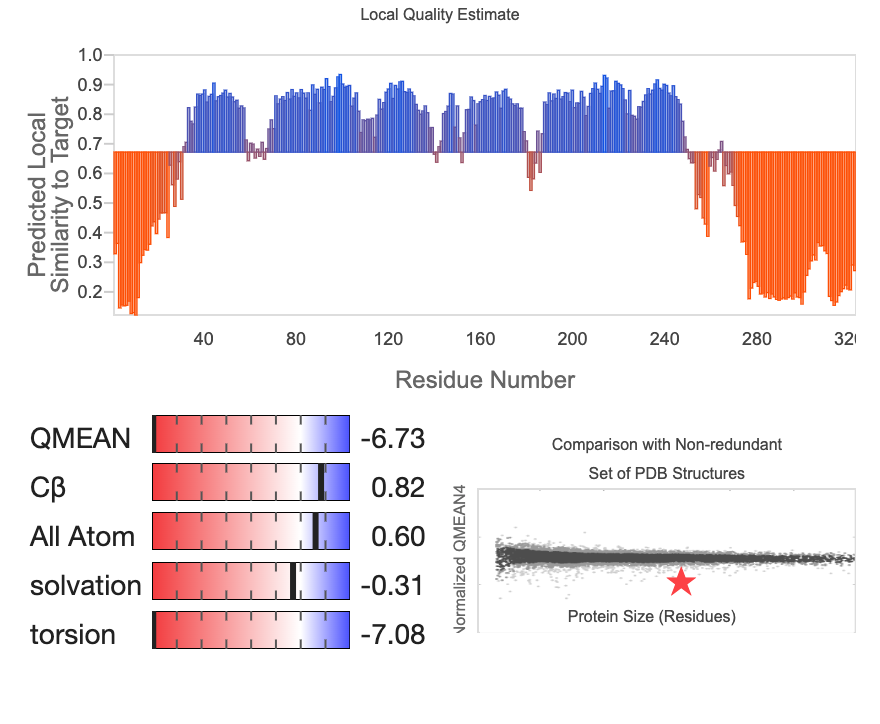

# Modelado estructural de AQP4 con AlphaFold2

### Sistema estudiado
**Proteína:** <<<Aquaporina 4>>>  
**Organismo:** <<<Homo sapiens>>>  
**UniProt/Accesión:** <<P55087>>  
**Longitud:** <<<323>>> aa  
**Secuencia empleada:** [AQP4.fa](data/AQP4.fa)

### Contexto biológico

La aquaporina 4 (AQP4) es un canal específico para el transporte pasivo de agua a través de membranas biológicas. Se expresa predominantemente en el sistema nervioso central y desempeña un papel fundamental en la homeostasis hídrica cerebral.
Está implicada en la regulación del intercambio de agua a nivel de la barrera hematoencefálica, transporte glinfático de solutos y mantenimiento del equilibrio osmótico en tejido cerebral.

Funcionalmente,se ha determinado que  cataliza el transporte selectivo de agua:
H₂O(in) ⇌ H₂O(out)

### Metodología

##### 1) Modelado estructural (AF2 – ColabFold)

La estructura tridimensional de AQP4 fue predicha utilizando AlphaFold2 a través del entorno ColabFold.
Configuración empleada:

- Modelo: alphafold2_ptm
- Tipo: Monómero
- Número de modelos generados: n = 5
- MSA: MMseqs2 (default)
- Relajación Amber: no aplicada (modelo unrelaxed)

Se seleccionó el modelo mejor rankeado (rank_001) para análisis posteriores.

Archivos principales generados :
Modelo final: [AQP4_7a696] (../results/colabfold/AQP4_7a696.pdb)
Métricas internas: [QP4_7a696_scores_rank_001_*.json] (../results/colabfold/AQP4_7a696_scores_rank_001_*.json)
Evidencia gráfica:
[AQP4_7a696_plddt.png](../results/colabfold/AQP4_7a696_plddt.png)
[AQP4_7a696_pae.png](../results/colabfold/AQP4_7a696_pae.png)
[AQP4_7a696_coverage.png](../results/colabfold/AQP4_7a696_coverage.png)

#### 2) Métricas internas de confianza (AF2)

Se analizaron las siguientes métricas:
- pLDDT: confianza local por residuo.
- pTM: confianza en la topología global del modelo.
- PAE: error alineado esperado para evaluar incertidumbre relativa entre regiones estructurales.

#### 3) Validación independiente (SwissModel Assess)
El modelo PDB seleccionado a partir del ranking fue evaluado en SwissModel Structure Assessment para obtener métricas de validación geométrica independientes:

- MolProbity (calidad estereoquímica global)
- Ramachandran plot (conformación del backbone)
- QMEANDisCo (calidad estructural global y local)

### Resultados

#### Confianza global del modelo

El modelo rank_001 fue seleccionado por presentar el mayor pLDDT promedio (81.2) y un pTM de 0.738.
Un pLDDT promedio de 81.2 indica buena confianza estructural global, aunque no uniforme en toda la secuencia. Encontrar valores alrededor de 80–85 en roteínas de membrana es frecuente, debido a la presencia de regiones flexibles periféricas.

El valor de pTM (0.738) señala que la topología global del modelo es consistente y que el plegamiento tridimensional general es confiable. Valores superiores a 0.7 suelen asociarse con una correcta organización espacial del dominio principal.

En general, estos valores indican que el modelo captura adecuadamente la arquitectura general de AQP4.

#### Distribución local de confianza (pLDDT por residuo)

El perfil de pLDDT que puede ser observado en la imagen muestra segmentación estructural. 

En la región N-terminal (~1–30 aa) presenta valores bajos (30–60), lo que indica alta flexibilidad, posible región desordenada y falta de restricciones estructurales fuertes en el MSA

En el núcleo central (~30–250 aa) see observan valores elevados (>90 en múltiples tramos), que son correspondientes a las seis hélices transmembrana características de las acuaporinas, lo que indica que el núcleo helicoidal está modelado con muy alta confianza local.

Por ultimo, en la región C-terminal (~260–323 aa) se observa una caída marcada del pLDDT (<50 en varios residuos), lo que sugiere presencia de una región intrínsecamente flexible o posible desorden estructural, este comportamiento es consistente con regiones citosólicas regulatorias de proteínas de membrana.

#### Análisis del PAE (Predicted Aligned Error)

El mapa de PAE muestra una zona central predominantemente azul oscuro (<5 Å), lo que indica baja incertidumbre relativa entre los residuos del núcleo estructural.
Además, no se observan bloques grandes de alta incertidumbre que sugieran dominios mal orientados.
y las regiones terminales muestran mayor error relativo, consistente con los valores bajos de pLDDT.

Esto respalda que que el núcleo transmembrana está correctamente ensamblado y que la incertidumbre se concentra en regiones periféricas y flexibles.

En general, estos resultados son coherentes con la naturaleza estructural esperada de una proteína canal de membrana, donde el dominio transmembrana es rígido y altamente conservado, mientras que las regiones citosólicas muestran mayor flexibilidad.

El modelo puede considerarse confiable para análisis estructurales del núcleo funcional del canal.

### Evaluación estructural con SwissModel

El modelo rank_001 fue posteriormente evaluado mediante SwissModel Structure Assessment.

#### Calidad estereoquímica global (MolProbity)
El análisis mediante MolProbity mostro los siguientes resultados:
- MolProbity score: 2.83
- Clashscore: 18.87
- Ramachandran favorecido: 80.06%
- Ramachandran outliers: 12.77%
- Rotamer outliers: 2.68%
- Cβ deviations: 0

Un MolProbity score de 2.83 indica una calidad estereoquímica moderada, en estructuras experimentales de alta resolución se esperan valores <2.0; sin embargo, para modelos predictivos no relajados este valor es aceptable.

El clashscore elevado (18.87) sugiere la presencia de contactos estéricos no optimizados, lo cual es coherente con el uso del modelo unrelaxed generado por AlphaFold2.

Se observa un porcentaje elevado de residuos en regiones outlier (12.77%), principalmente asociados a regiones terminales y segmentos flexibles

La ausencia de desviaciones Cβ indica que no existen distorsiones graves en la geometría backbone–sidechain.

#### Diagrama de Ramachandran

El análisis muestra:
- 80.06% de residuos en regiones favorecidas
- 12.77% en regiones prohibidas

En el diagrama podemos observar que la mayoría de residuos del núcleo estructural se ubican en regiones permitidas típicas de hélices α y que los outliers no se concentran en el núcleo helicoidal, sino que están asociados principalmente a regiones periféricas.

Esto concuerda con  las regiones N- y C-terminales de baja confianza observadas en pLDDT y los segmentos flexibles extracelulares y citosólicos.

Es importante señalar que proteínas de membrana modeladas sin refinamiento suelen mostrar un incremento artificial en outliers debido a falta de minimización energética.

####  MEANDisCo: Calidad global y local

Valor global:
QMEANDisCo = 0.67 ± 0.05

Este valor indica que el modelo presenta una calidad estructural razonable comparado con estructuras experimentales de tamaño similar. No se encuentra en el rango óptimo (>0.8), pero tampoco en valores críticos (<0.5).

Perfil local
El gráfico de calidad local muestra valores elevados (~0.8–0.9) en el núcleo transmembrana (~30–250 aa), un descenso marcado en los extremos N-terminal y C-terminal y caídas en algunos bucles interhelicoidales.

Este patrón reproduce lo observado en el perfil pLDDT de AlphaFold2 y el mapa PAE, lo que muestra la concordancia entre AF2 y QMEANDisCo y fortalece la consistencia del modelo.

Aunque el modelo muestra una arquitectura transmembrana bien definida y consistente con la familia de acuaporinas, la calidad estereoquímica global es inferior a la esperada para estructuras experimentales de alta resolución. El porcentaje elevado de residuos en regiones Ramachandran outlier y el clashscore nos dice que el modelo requiere de un refinamiento energético adicional.

Sin embargo, la concordancia entre pLDDT, PAE y QMEANDisCo en el núcleo transmembrana respalda la robustez estructural del dominio funcional principal. Los valores con deficiencia se concentran en regiones terminales, las cuales son estructuralmente flexibles y menos conservadas evolutivamente.

