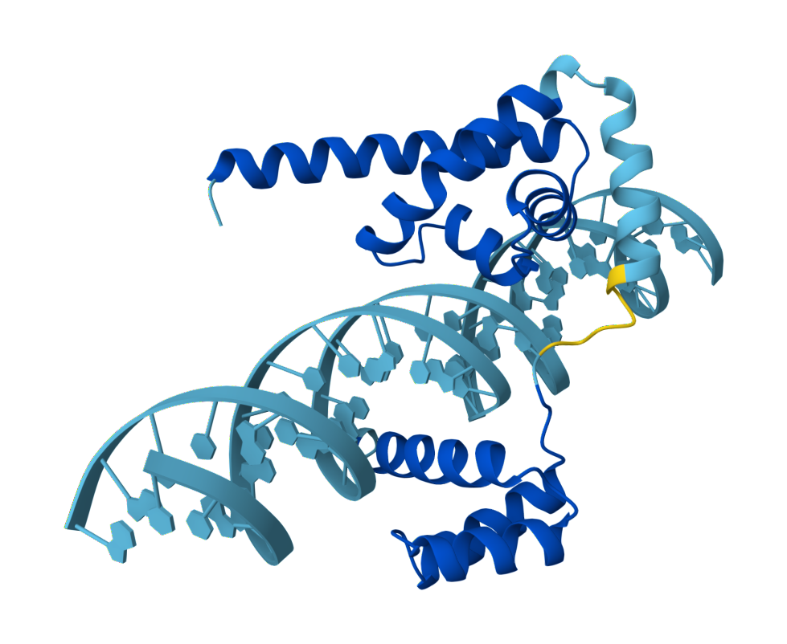
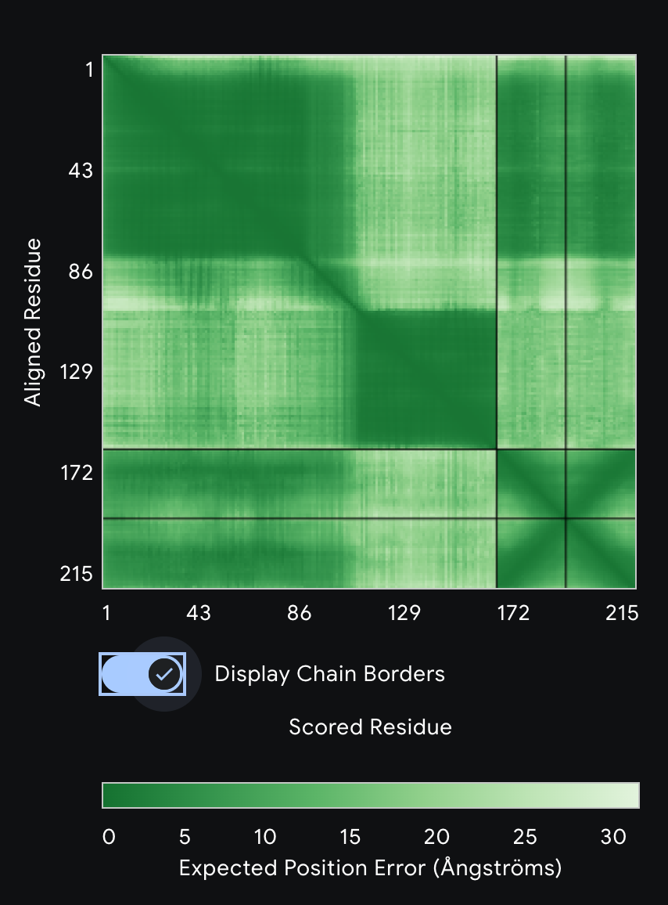
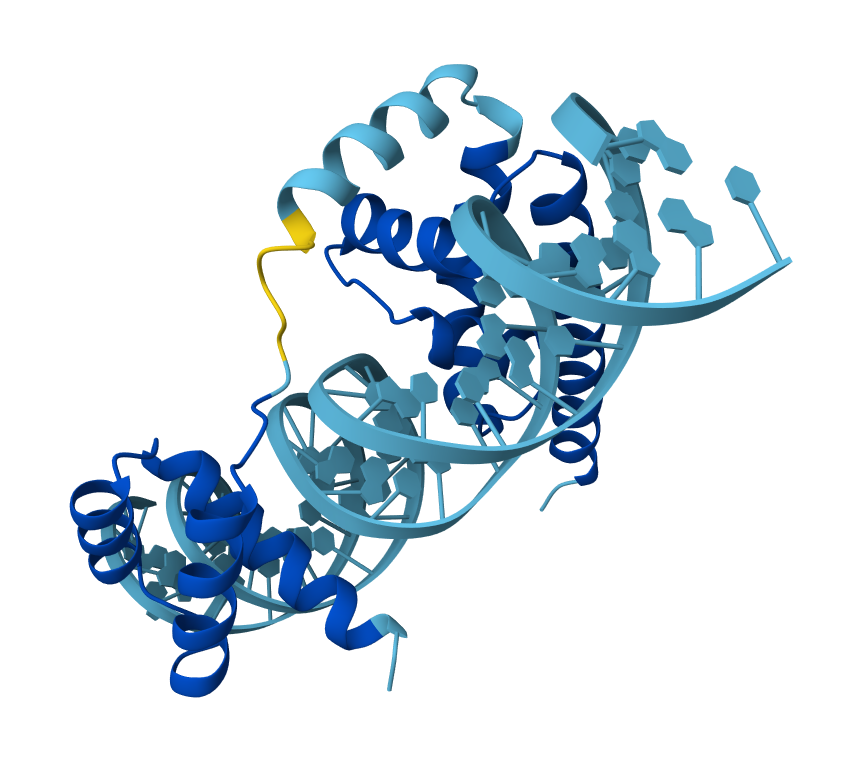
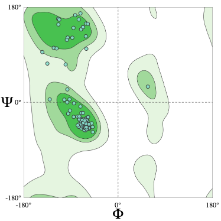
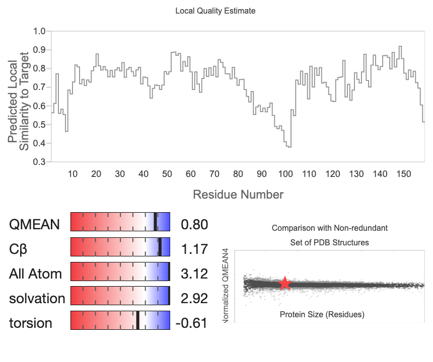

# Modelado estructural del complejo POU5F1–ADN con AlphaFold3

### Sistema estudiado
- Proteína: POU5F1 (OCT4)
- Organismo: Homo sapiens
- UniProt: Q01860
- Dominio modelado: POU (residuos 138–289)
- ADN: Dúplex de 28 pb conteniendo el motivo consenso 5’-ATGCAAAT-3’

### Contexto biológico

POU5F1 (OCT4) es un factor de transcripción que reconoce el motivo octamer 5’-ATTTGCAT-3’ en el ADN. Esta secuencia corresponde al complemento del motivo ATGCAAAT utilizado en este modelo. La unión ocurre principalmente a través del dominio POU, el cual permite el reconocimiento específico en el surco mayor del ADN.

OCT4 desempeña un papel esencial en el desarrollo embrionario temprano y en el mantenimiento de la pluripotencia de las células madre embrionarias. Regula genes clave involucrados en diferenciación y autorrenovación celular.

### Metodología

1) Modelado estructural (AlphaFold3)
El complejo proteína–ADN fue modelado utilizando AlphaFold3 

Configuración empleada:
- Cadena A: Dominio POU (138–289)
- Cadenas B y C: ADN de doble cadena (28 pb)
- Parámetros por defecto

Se generaron múltiples modelos y se seleccionó el de mayor confianza en la interfaz (ipTM).

### Resultados

### Modelado estructural (AlphaFold3)

ESTRUCTURA CUATERNARIA GENERADA POR ALPHAFOLD3

**Confianza del modelo (AF3)**
El modelo seleccionado presentó:
- ipTM = 0.80
- pTM = 0.74

Un ipTM de 0.80 indica alta confianza en la interfaz proteína–ADN.
El valor de pTM sugiere que el dominio POU se encuentra correctamente plegado.

El mapa PAE muestra bloques bien definidos dentro de cada cadena y menor incertidumbre en la región de contacto, lo que respalda una orientación coherente entre proteína y ADN.

Visualmente, el dominio POU se inserta en el surco mayor del ADN, consistente con el modo de unión descrito para proteínas de esta familia.

### Validación SwissModel

El modelo seleccionado fue evaluado mediante SwissModel Assess para analizar su calidad geométrica

#### Calidad estereoquímica global (MolProbity)

- MolProbity Score: 1.57
- Clashscore: 11.28

Un MolProbity menor a 2.0 indica buena calidad estructural global.
El clashscore es moderado y los choques reportados se localizan principalmente en nucleótidos del ADN o en la interfaz, lo cual es común en modelos predichos que no han sido refinados energéticamente.

#### Diagrama de Ramachandran

- Residuos favorecidos: 98.73%
- Outliers: 0.00%

Esto indica que el backbone del dominio POU está correctamente modelado, sin conformaciones anómalas.

La ausencia de outliers respalda la estabilidad estructural del dominio proteico.

#### QMEANDisCo

- QMEANDisCo Global: 0.73 ± 0.07

Este valor indica una calidad estructural adecuada en comparación con estructuras experimentales de tamaño similar.
El perfil de calidad local muestra valores elevados en la mayor parte del dominio, con una pequeña disminución en una región central compatible con el linker flexible entre subdominios, este comportamiento es consistente con la naturaleza estructural del dominio POU.

La concordancia entre las métricas ide AlphaFold3 (ipTM y pTM) y la validación independiente de SwissModel respalda que el modelo presenta una interfaz proteína–ADN confiable, con una geometría estereoquímica adecuada y que posee ausencia de distorsiones estructurales graves. 

El complejo modelado es consistente con el reconocimiento del motivo octamer en el surco mayor del ADN, como se describe para proteínas de la familia POU, E general, el modelo puede considerarse estructuralmente sólido y apropiado para describir la interacción POU5F1–ADN.

